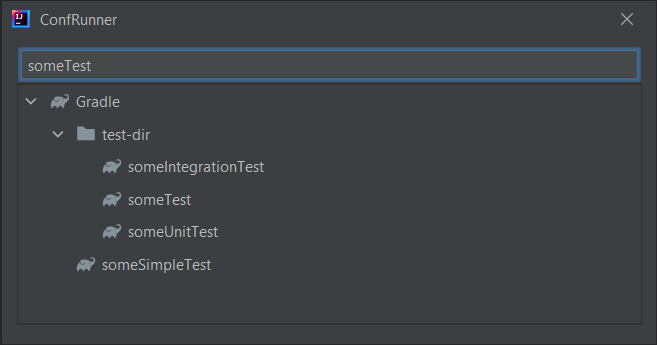

# ConfRunner Plugin

ConfRunner Plugin is a plugin for JetBrains IntelliJ IDEA, that can be used to simplify execution of configurations in run and debug mode.

Enables an easy way of executing configurations using keyboard shortcuts.

It displays simplified popup dialog with defined configurations and enables to go through configurations and execute a
specific one. Open the dialog using either Tools tab (Tools > ConfRunner) or using a shortcut.

### Installation
[https://plugins.jetbrains.com/plugin/18230-confrunner](https://plugins.jetbrains.com/plugin/18230-confrunner)

### Settings

You can specify which configuration types should be excluded from the dialog

### Keyboard shortcuts:

* **Ctrl + Alt + /** - open dialog
* **Tab** / **Arrow Down** / **Arrow Up** - select next / previous item
* **Arrow Left** / **Arrow Right** / **Enter** - on folder / type - expand / collapse children
* **Enter** - on specific configuration - execute in Run mode
* **Ctrl + Enter** - on specific configuration - execute in Debug mode
* **Ctrl + F** / **IDEA Find Shortcuts** - go back to text lookup component

### Mouse actions:

* **Double Click** - on specific configuration - execute in Run mode
* **Ctrl + Double Click** - on specific configuration - execute in Debug mode

## Filtering configurations:

When filtering by only lowercase characters, exact consecutive characters combination is used to match

After detecting uppercase character, the regex pattern is split into parts:
Text: '*someTest*' will be actually used as '*some.**test*'

It also supports filtering using regex

